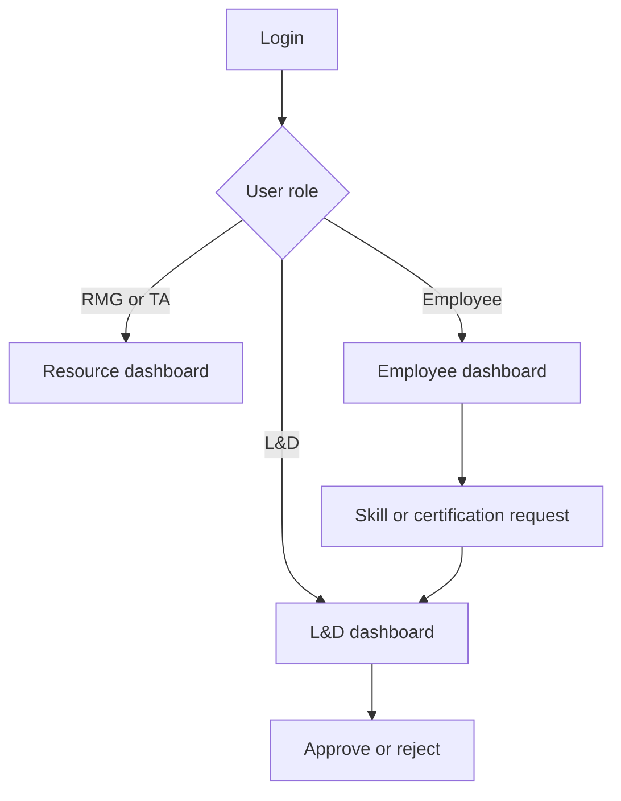

# Employee360 Dashboard

Employee360 is a role-based Flask application that gives Resource Management, Talent Acquisition, Learning & Development, and employees a consolidated view of workforce allocation, skills, learning, certifications, performance, and project history.

> This repository and its database dump contain synthetic demonstration data only. They must not be treated as production employee records.

## Main capabilities

- Role-based login and authorization
- RMG/TA workforce dashboard with employee, allocation, bench, utilization, department, project, and skill filters
- Employee self-service dashboard for viewing profile information and submitting skill or certification requests
- L&D dashboard for reviewing and approving/rejecting skill and certification requests
- Project allocation and project-history reporting
- Skill-category browsing and certification mapping
- Certificate attachment upload and retrieval

## Roles and application flow

| Role | Landing page | Access |
| --- | --- | --- |
| `RMG` | `/` | Workforce and resource-management dashboard |
| `TA` | `/` | Workforce and talent-acquisition dashboard |
| `Employee` | `/employee-dashboard` | Employee profile, skills, projects, and requests |
| `L&D` | `/lnd-dashboard` | Skill and certification request management |



## Technology stack

- Python and Flask
- MySQL 8
- Jinja2 templates
- HTML and CSS
- MySQL Connector/Python
- Gunicorn for production hosting

## Project structure

```text
employee360-dashboard/
├── app.py
├── requirements.txt
├── README.md
├── .env.example
├── .gitignore
├── data/
│   └── employee360_synthetic_data.sql
├── static/
│   ├── anblickslogo.png
│   ├── employee.css
│   ├── lnd.css
│   ├── login.css
│   └── style.css
├── templates/
│   ├── dashboard.html
│   ├── employee_dashboard.html
│   ├── lnd_dashboard.html
│   └── login.html
└── uploads/
    └── certificates/
```

## Database tables

| Table | Purpose |
| --- | --- |
| `hrms_data` | Employee profile and organization information |
| `project_management` | Current project assignments, dates, status, and allocation |
| `project_history` | Completed/historical project contributions |
| `skills_repository` | Employee skills, proficiency, and skill categories |
| `lms` | Learning and certification information |
| `performance_management` | Employee performance data |
| `login` | Demo user email, password, and role |
| `skill_requests` | Employee skill-change requests |
| `certification_requests` | Employee certification requests and attachments |
| `skill_certification_mapping` | Skill-to-certification recommendations |

The dump also contains backup copies of the project tables. They are included only because they exist in the supplied synthetic database.

## Prerequisites

- Python 3.10 or newer
- MySQL 8.0 or a compatible Azure Database for MySQL instance
- `pip`

## Local setup

### 1. Clone the repository

```bash
git clone <repository-url>
cd employee360-dashboard
```

### 2. Create and activate a virtual environment

Windows PowerShell:

```powershell
python -m venv .venv
.venv\Scripts\Activate.ps1
```

macOS/Linux:

```bash
python3 -m venv .venv
source .venv/bin/activate
```

### 3. Install dependencies

```bash
pip install -r requirements.txt
```

### 4. Import the synthetic database

Using MySQL Workbench:

1. Open **Server > Data Import**.
2. Select **Import from Self-Contained File**.
3. Choose `data/employee360_synthetic_data.sql`.
4. Start the import.

Using the MySQL command line:

```bash
mysql -u root -p < data/employee360_synthetic_data.sql
```

The dump creates and selects a schema named `railway`. The database name may be changed after import as long as `DB_NAME` is updated accordingly.

### 5. Configure environment variables

Copy `.env.example` to `.env`, supply the correct values, and load them in the terminal or IDE. The application reads operating-system environment variables directly; it does not automatically load `.env`.

Required variables:

| Variable | Description |
| --- | --- |
| `DB_HOST` | MySQL server hostname |
| `DB_PORT` | MySQL port, normally `3306` |
| `DB_USER` | MySQL username |
| `DB_PASSWORD` | MySQL password |
| `DB_NAME` | Database/schema name |
| `SECRET_KEY` | Long random value used to secure Flask sessions |

Optional variables:

| Variable | Description |
| --- | --- |
| `FLASK_ENV` | Set to `production` in a hosted environment |
| `CERTIFICATE_UPLOAD_FOLDER` | Persistent directory used for uploaded certificate files |

Example for Windows PowerShell:

```powershell
$env:DB_HOST="localhost"
$env:DB_PORT="3306"
$env:DB_USER="root"
$env:DB_PASSWORD="your-local-password"
$env:DB_NAME="railway"
$env:SECRET_KEY="replace-with-a-long-random-value"
python app.py
```

### 6. Open the application

Visit [http://localhost:5000](http://localhost:5000).

## Demo logins

The supplied synthetic dump contains demo accounts for all four roles. Example accounts are:

| Role | Email | Password |
| --- | --- | --- |
| RMG | `natasha@anblicks.com` | `natasha@789` |
| TA | `shrestha@anblicks.com` | `shrestha@345` |
| L&D | `fathima@anblicks.com` | `fathima@123` |
| Employee | `ajay.rao@anblicks.com` | `Apex@2026` |

These credentials are intentionally limited to the synthetic demo dataset. Do not reuse them in another system.

## Production execution

Run the application with Gunicorn:

```bash
gunicorn --bind=0.0.0.0:${PORT:-8000} --timeout 120 app:app
```

## Azure App Service notes

1. Create a Linux Web App with a supported Python runtime.
2. Connect the Web App to an Azure Database for MySQL Flexible Server instance, or another reachable MySQL 8 database.
3. Import `data/employee360_synthetic_data.sql` into that database.
4. Add the variables from `.env.example` under **App Service > Configuration > Application settings**.
5. Set `FLASK_ENV=production`.
6. Use the following App Service startup command:

```text
gunicorn --bind=0.0.0.0:8000 --timeout 120 app:app
```

7. If certificate uploads must survive application restarts, configure persistent storage and set `CERTIFICATE_UPLOAD_FOLDER` to that mounted directory.
8. Restrict database network access to the application and use TLS according to the organization’s Azure security standards.

## Security considerations

- Never commit `.env`, database URLs, passwords, Azure keys, or production exports.
- Replace the demo login mechanism with hashed passwords or organizational SSO before production use.
- The current SQL dump stores demo passwords in plain text so the synthetic application can be evaluated. It is not suitable for production authentication.
- Use a strong, unique `SECRET_KEY` in every deployed environment.
- Uploaded certificate files may contain sensitive information; validate the organization’s retention and access requirements before enabling production uploads.

## Troubleshooting

### Database connection fails

Confirm that all `DB_*` values are configured, the MySQL server permits the client connection, and the selected schema has been imported.

### CSS or templates do not load

Keep the `static` and `templates` directories at the same level as `app.py` and preserve their filenames.

### Certificate attachments disappear after restart

The default upload location is local application storage. Configure a persistent mounted location and set `CERTIFICATE_UPLOAD_FOLDER` for hosted deployments.

## Data notice

All names, emails, project information, skills, credentials, and other records in `employee360_synthetic_data.sql` are supplied as synthetic demonstration data. Review the dump again before external sharing if any real information is added later.
